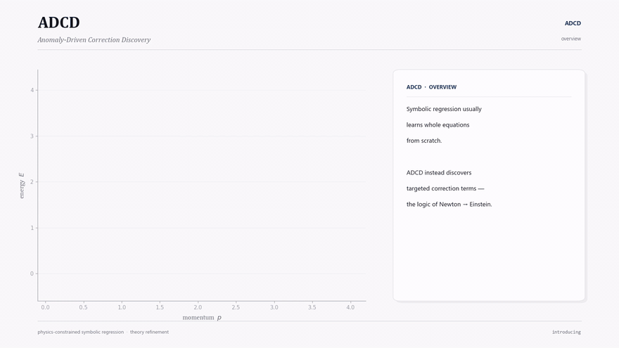

# ADCD — Anomaly-Driven Correction Discovery

<p align="center">
  <em>Physics-constrained symbolic regression that discovers <b>correction terms</b> — not equations from scratch.<br>
  The same corrective logic historically used to refine Newtonian mechanics into special relativity, or the Rayleigh–Jeans law into Planck's law — automated.</em>
</p>

<p align="center">
  
</p>

<p align="center">
  <a href="assets/adcd_discovery.mp4">▶ Download video (MP4)</a>
</p>

<p align="center">
  <a href="https://doi.org/10.5281/zenodo.20534940"></a>
  <a href="LICENSE"></a>
  <a href="https://pypi.org/project/adcd/"></a>
</p>

---

### Contents

- [Overview](#overview)
- [Key Features](#-key-features)
- [Installation](#-installation)
- [Quick Start](#-quick-start)
- [Benchmark Results](#-benchmark-results)
  - [Synthetic anomaly benchmark](#1-synthetic-anomaly-benchmark-9-scenarios--4-noise-levels--16-seeds)
  - [Comparison with unconstrained symbolic regression (PySR)](#2-comparison-with-unconstrained-symbolic-regression-pysr)
  - [Real-world physical-constant validation](#3-real-world-physical-constant-validation)
  - [SPARC: autonomous rediscovery of the Simple-MOND family](#4-sparc-autonomous-rediscovery-of-the-simple-mond-family)
  - [Cosmological probes](#5-cosmological-probes-growth-rate-and-expansion-history)
  - [Multivariable extension (Phase 2, exploratory)](#6-multivariable-extension-phase-2--exploratory)
- [Scope & Limitations](#-scope--limitations)
- [Project Structure](#-project-structure)
- [Citing This Work](#-citing-this-work)
- [Reproducibility](#-reproducibility)
- [License](#-license)

---

## Overview

Traditional symbolic regression (AI Feynman, PySR, DSR) discovers equations *from scratch* — the entire hypothesis space of functions is on the table. **ADCD instead starts from a known classical law and searches for the dimensionless correction term Δ** that reconciles it with an anomalous observation. This mirrors how physics has actually progressed historically: relativistic kinetic energy is a correction to ½mv², the screened Coulomb potential is a correction to Coulomb's law, and Planck's law is a correction to Rayleigh–Jeans. Restricting the search to this much smaller "correction subspace" is what makes physics-gated screening (dimensional homogeneity, asymptotic consistency, complexity limits) tractable *before* any numerical optimization runs.

> **Headline result (primary claim):** mean structural recovery of **80.4% (± 7.4%) across sixteen independent seeds** on the 9-scenario × 4-noise-level synthetic benchmark (95% bootstrap CI [76.7%, 84.0%]). The reference seed `42` used for the detailed tables below is **explicitly disclosed as the highest-performing seed (94.4%)** in that set — the mean, not the peak, is what we report as the headline number. Full per-seed × per-noise data ships in `results/seed_distribution.json`.

---

## ⚡ Key Features

- **Correction-First Paradigm** — Starts from a known classical law, not a blank slate. The search targets only the residual discrepancy Δ between theory and observation, not the full function space.
- **Cascaded Physics Gates** — AST complexity, dimensional homogeneity with a transcendental-argument guardrail, and asymptotic-regime consistency (ARC) screen out unphysical candidates *before* parameter fitting.
- **JAX-Traced L-BFGS-B Optimizer** — JIT-compiled, differentiable multi-restart fitting with log-uniform initialization.
- **BIC Model Selection** — Ranks surviving candidates by the Bayesian Information Criterion, penalizing free parameters so that parsimonious, structurally correct expressions win over flexible overfits.
- **Residual Feature Intelligence** — Extracts monotonicity, curvature, oscillation, and decay-rate signatures from the residual to bias candidate proposal toward plausible functional families.
- **Phase 2 — Multivariable Discovery (exploratory)** — Buckingham-Π dimensionless-group decomposition, per-variable Sequential ARC checking, and a product-grammar proposer for multi-input corrections.
- **Validated on real anomalies** — Correct structural class recovered on 4/4 established textbook-to-precision physics scenarios (Mercury perihelion, Lamb shift, muon g−2, blackbody radiation), and on a real astrophysical dataset (SPARC galaxy rotation curves — see below).

---

## 📦 Installation

Install the stable package from PyPI:

```bash
pip install adcd
```

Or install from source:

```bash
git clone https://github.com/apiprdt/PhysicsPaper.git
cd PhysicsPaper
pip install -e ".[dev]"
```

Verify your installation:
```bash
pytest tests/
```

---

## 💻 Quick Start

### 1. High-Level Scientific API

Running ADCD on predefined physics benchmarks:

```python
import adcd

# 1. Load a pre-defined benchmark scenario (e.g. Relativistic Kinetic Energy)
scenarios = adcd.get_all_scenarios()
scenario = scenarios[0]

# 2. Run discovery
result = adcd.discover_correction(scenario, max_iterations=5, proposer="mock")

# 3. View the best fit
print(f"Discovered correction: {result.best_expr}")       # θ₀ * (v/c)**2
print(f"LaTeX representation:  {result.export_latex()}")   # \theta_0 \left(\frac{v}{c}\right)^2
print(f"Parameters:            {result.best_theta}")
print(f"BIC Score:             {result.best_bic:.2f}")

# 4. Plot residuals
result.plot_residuals()
```

### 2. Custom Experimental Datasets

```python
import numpy as np
import adcd

# Your custom data
x = np.linspace(1.0, 5.0, 100)
X = {"x": x}
y_classical = 2.0 * x
y_observed  = 2.0 * x + 0.5 * x**2   # True correction is 0.5 * x^2

# Run ADCD
result = adcd.fit(
    X=X,
    y_obs=y_observed,
    y_classical=y_classical,
    limit_variable="x",
    limit_direction="0",
    correction_mode="additive",
    log_param=True,       # Enable for numerical stability at extreme scales
    verbose=True           # Use verbose="debug" for compiler/warning logging
)

print(result.summary())
```

### 3. Dual-Mode Telemetry & Execution Control

- **Scientist Mode (`verbose=True`, default)** — Suppresses compile logs (JAX/TPU) and numerical warnings from divergent candidates during screening. Prints a clean progress bar and a final summary table.
- **Developer Mode (`verbose="debug"`)** — Bypasses all suppression. Streams raw compiler diagnostics, warning stack traces, and per-gate metrics directly to the console.

---

## 📊 Benchmark Results

All numbers below are reproducible from the scripts listed under [Reproducibility](#-reproducibility); none are hand-typed into the paper or this document.

### 1. Synthetic anomaly benchmark (9 scenarios × 4 noise levels × 16 seeds)

| Noise level | ADCD mean (16 seeds) | ADCD worst seed at this noise | ADCD best (seed=42) |
|:-----------:|:---------------------:|:------------------------------:|:--------------------:|
| 0%  | 86.8% (±9.8%)  | 66.7% (6/9) | 100% (9/9) |
| 1%  | 81.2% (±14.6%) | 44.4% (4/9) | 100% (9/9) |
| 5%  | 77.1% (±10.0%) | 66.7% (6/9) | 88.9% (8/9) |
| 10% | 76.4% (±12.3%) | 55.6% (5/9) | 88.9% (8/9) |
| **Overall** | **80.4% (±7.4%)** | **69.4% (25/36, overall worst seed)** | **94.4% (34/36)** |

Reference-seed detail (seed=42, Mock Proposer):

| Scenario | Tier | 0% Noise | 1% Noise | 5% Noise | 10% Noise |
|----------|------|:--------:|:--------:|:--------:|:---------:|
| Relativistic KE | Textbook | ✓ | ✓ | ✓ | ✓ |
| Yukawa Gravity | Textbook | ✓ | ✓ | ✓ | ✓ |
| Anharmonic Spring | Textbook | ✓ | ✓ | ✓ | ✓ |
| Screened Coulomb | Cross-Domain | ✓ | ✓ | ✗ | ✗ |
| Net Radiation | Cross-Domain | ✓ | ✓ | ✓ | ✓ |
| Nonlinear Drag | Cross-Domain | ✓ | ✓ | ✓ | ✓ |
| Mystery-A (tanh²) | Synthetic | ✓ | ✓ | ✓ | ✓ |
| Mystery-B (sinc) | Synthetic | ✓ | ✓ | ✓ | ✓ |
| Mystery-C (log-quotient) | Synthetic | ✓ | ✓ | ✓ | ✓ |
| **Overall** | | **100%** | **100%** | **88.9%** | **88.9%** |

At 5%/10% noise the only recurring miss is **Screened Coulomb**, where an exponential decay `e^(-r/λ)` and a rational-saturation proxy `r/(r+λ)` become numerically difficult to distinguish at low dynamic range — an information-theoretic limit of the data, not a gate failure (see [Limitations](#-scope--limitations)).

### 2. Comparison with unconstrained symbolic regression (PySR)

To isolate the effect of physics-gated search from other confounds, ADCD is compared against [PySR](https://github.com/MilesCranmer/PySR) on the **identical residual target** `y_obs − y_classical`, across the same 9 scenarios and 4 noise levels. Three PySR configurations are used:

| Profile | Iterations | Max size | Timeout | Purpose |
|---|:--:|:--:|:--:|---|
| `fair` (primary) | 100 | 30 | 60 s | near PySR's own recommended defaults |
| `generous` | 200 | 40 | 120 s | upper-bound budget ablation (2× search budget) |
| `fast` (legacy) | 15 | 15 | 25 s | wall-clock-matched reference only |

Both methods share the same operator set and a fixed seed per run.

| Method | 0% | 1% | 5% | 10% |
|--------|:--------:|:--------:|:--------:|:---------:|
| **ADCD** (seed=42) | **9/9 (100%)** | **9/9 (100%)** | **8/9 (88.9%)** | **8/9 (88.9%)** |
| ADCD, mean over 16 seeds | 86.8% | 81.2% | 77.1% | 76.4% |
| ADCD, worst of 16 seeds | 66.7% | 44.4% | 66.7% | 55.6% |
| PySR `fair` | 44.4% (4/9) | 55.6% (5/9) | 11.1% (1/9) | 55.6% (5/9) |
| PySR `generous` | 44.4% (4/9) | 44.4% (4/9) | 55.6% (5/9) | 22.2% (2/9) |

At the 5%-noise headline point, ADCD's seed=42 run exceeds PySR `fair` by 77.8 percentage points; the gap measured against ADCD's 16-seed mean is 66.0 points. Doubling PySR's search budget (`generous`) improves its 5%-noise result but does not close the gap to ADCD, and PySR's accuracy does not degrade monotonically with noise across configurations — a pattern discussed in the paper (Section 6) as an interaction between search geometry and the amount of regularizing label noise.

**Note on comparison basis.** ADCD's figures aggregate 16 independent seeds; each PySR configuration was run once per (scenario, noise) pair with `deterministic=True`, following PySR's own reproducible-run convention. Read this as a *matched-residual, matched-operator-set* comparison rather than a *matched-sample-size* one. Running PySR across the same 16 seeds is a natural next step toward a fully symmetric comparison, and is called out explicitly as future work.

### 3. Real-world physical-constant validation

Five anomalies constructed from JPL DE440, NIST/CODATA, and CERN Particle Data Group constants (Mock Proposer, seed=42, extended template mode). Only Mercury has an exact ground-truth template in the proposer bank; the rest are evaluated against generic functional families (see paper Table 10 for the full template-leakage disclosure).

| Scenario | True Δ | Discovered Δ | Structural match | Quantitative (NMSE < 1e-4) | Converged (NMSE < 1e-5) | NMSE |
|---|---|---|:---:|:---:|:---:|---:|
| Mercury Perihelion (GR) | θ₀(v/c)² | θ₀(v/c)² | ✓ exact AST match | ✓ | ✗ | 1.11×10⁻⁵ |
| Hydrogen Lamb Shift (QED) | θ₀/n³ | θ₀(n/θ₁)^(−θ₂) | ✓ power_law | ✓ | ✓ | 1.69×10⁻¹⁸ |
| Muon g−2 (Schwinger) | θ₀α/π | θ₀(α/π)^θ₁, θ₁≈1.005 | ✓ polynomial | ✓ | ✓ | 7.94×10⁻⁷ |
| Blackbody Radiation (Planck) | exp(−hf/k_BT) | −1 + e^(−f/θ₁) | ✓ exponential (structure only) | ✗ | ✗ | 2.59×10⁻² |

**Net result: 4/4 structural, 3/4 quantitative, 2/4 optimizer-converged.** Binary pulsar orbital decay (Hulse–Taylor) is evaluated separately as a controlled sensitivity study — not counted in this headline — because its benchmark formulation fixes three of four orbital parameters; recovery degrades as more parameters are exposed and fails structurally under the full four-parameter scan (paper Section 5.4, Table 11).

> *Correction: an earlier version of this README listed the Lamb Shift NMSE as `1.82e-18`. The value verified against the paper and reproduction artifacts is `1.69e-18`, used above.*

### 4. SPARC: autonomous rediscovery of the Simple-MOND family

As a capstone real-observational test, ADCD was applied to the [SPARC](https://arxiv.org/abs/1606.09251) sample of galactic rotation curves (171 galaxies, 3,342 radial points), starting only from the Newtonian baseline and the asymptotic constraint that the correction must vanish in the high-acceleration (Newtonian) limit.

| Metric | Result |
|---|---|
| Sample | 171 galaxies, 3,342 radial points |
| Discovered transition parameter ĉ (θ̂₁) | 0.27, vs. canonical Simple-MOND c = 4.0 |
| Stacked-NMSE reduction vs. zero-parameter canonical forms | 41% |
| Galaxy-level CV vs. 2-parameter Simple MOND / RAR | statistically indistinguishable (Δ NMSE = 0.008, z = 0.39, p = 0.69) |
| Galaxy-level CV vs. 2-parameter Standard MOND | decisively better (z = −4.60) |
| Cluster bootstrap δBIC_eff vs. 2-param Simple MOND (1,000 resamples) | +3.4, 95% CI [−0.9, +7.0] → inconclusive |
| Cluster bootstrap δBIC_eff vs. 2-param Standard MOND | −36.5, 95% CI [−60.1, −17.9] → very strong evidence for ADCD |

The discovered form is algebraically the Simple-MOND interpolating family of Famaey & Binney (2005) — **this is reported as autonomous rediscovery of a known family from real data, not the discovery of a novel one.** An exploratory cross-check against wide-binary-star kinematics (Appendix A of the paper) shows the fitted form does **not** unambiguously generalize to that independent dataset, which we disclose as a limitation rather than omit.

### 5. Cosmological probes: growth rate and expansion history

Extending the same machinery to cosmological-tension datasets — 63 fσ₈ growth-rate points ([Alestas et al. 2022](https://arxiv.org/abs/2110.04336)) and 34 model-independent H(z) cosmic-chronometer points — across five independent tests (two observables, three homogeneous survey subsets):

| Test (dataset) | N | Observable | Best candidate | ΔBIC vs. constant offset | Verdict |
|---|:--:|---|---|:--:|---|
| Full compilation (Alestas+22) | 63 | fσ₈ | Constant offset | 0.00 | `constant_wins` |
| BOSS DR12 (Alam+17) | 6 | fσ₈ | Linear | −9.63 (short of decisive threshold at N=6) | `constant_wins` |
| Precision (top-20) | 20 | fσ₈ | Constant offset | 0.00 | `constant_wins` |
| Mid-z window [0.35, 0.75] | 31 | fσ₈ | Power law | −0.00 | `constant_wins` |
| Cosmic chronometers | 34 | H(z) | Constant offset | 0.00 | `constant_wins` |

**No z-dependent functional correction is detected in any test.** Best-fit amplitude σ₈,₀ = 0.7815 vs. Planck 2018's 0.811 — a direction consistent with the S8 tension, though the null result constrains rather than explains its physical origin. We report `constant_wins` as **a quantitative upper bound on the detectability of a functional growth correction given current survey precision** (~20% typical point errors across 15+ heterogeneous surveys) — not as proof that no such correction exists.

### 6. Multivariable extension (Phase 2, exploratory)

Reported as an exploratory capability, not a headline result — the two multivariable proposers fail for disjoint reasons (template-bank coverage vs. numerical ill-conditioning of Π-group fitting at extreme scales), and no gate reports a confident spurious correction even on failure.

| Scenario | Variables | 0% | 1% | 5% | Notes |
|----------|-----------|:--:|:--:|:--:|-------|
| MV-1: Yukawa mass-ratio | m, M, r | ✗ / ✓* | ✗ / ✗ | ✗ / ✗ | *ProductGrammar only; Mock proposer never spans this class |
| MV-2: Plasma screening | n, T | ✓ / ✗ | ✓ / ✗ | ✓ / ✗ | ProductGrammar defeated by extreme-scale ill-conditioning |
| MV-3: Turbulent drag | ρ, v | ✓ / ✓ | ✓ / ✓ | ✗ / ✗ | Both lose to residual blow-up at 5% noise |
| MV-4: Van der Waals | n, V | ✓ / ✗ | ✓ / ✗ | ✓ / ✗ | ProductGrammar: spurious exponential mismatch |
| **Mock proposer total** | | 3/4 | 3/4 | 2/4 | |
| **ProductGrammar total** | | 2/4 | 1/4 | 0/4 | |

---

## ⚠️ Scope & Limitations

Full discussion in paper Section 7. Summarized honestly here rather than left implicit:

- **Correction-first scope.** ADCD assumes the classical baseline is *structurally correct* and the anomaly is incremental. If the baseline is fundamentally wrong, the correction term can become arbitrarily complex and the correction-first search loses its advantage over tabula rasa symbolic regression.
- **Proposer expressiveness bound.** Discovery is bounded by the template bank (Mock proposer) or the LLM's zero-shot vocabulary (Gemini/Hybrid proposer). Structures outside that vocabulary cannot be found.
- **Information-theoretic limits at high noise.** Some structures (e.g., exponential decay $e^{-r/\lambda}$ vs. rational saturation $r/(r+\lambda)$) become genuinely indistinguishable at low SNR and limited dynamic range — a property of the data, not a defect of the pipeline.
- **Reduced-variable real-world benchmarks.** The binary-pulsar scenario in the headline real-world tier uses a simplified, single-free-variable formulation; the full four-parameter Peters formula is not yet solved (Table 11).
- **Cross-system generalization is not guaranteed.** The SPARC-discovered interpolating function does not unambiguously transfer to wide-binary-star kinematics — treated as a provisional, disclosed limitation, not omitted.
- **Cosmological null result is a bound, not a proof.** `constant_wins` reflects current survey precision; it does not rule out a functional correction below the current detection threshold.

---

## 📁 Project Structure

```
adcd-v3.0.0/
├── src/adcd/                       # Installable package
│   ├── __init__.py                 # Public API (fit, discover_correction)
│   ├── anomaly_scenarios.py        # 9 standard + 3 blind + 4 multivariable scenarios
│   ├── arc_scorer.py               # Asymptotic consistency gate (ARC)
│   ├── buckingham_pi.py            # [Phase 2] Buckingham Π group engine
│   ├── coarse_evaluator.py         # Coarse numerical pre-filter
│   ├── correction_orchestrator.py  # Main multi-iteration discovery loop
│   ├── dimensional_checker.py      # Dimensional homogeneity + transcendental gate
│   ├── jax_optimizer.py            # JAX L-BFGS-B optimizer
│   ├── llm_proposer.py             # Mock + Gemini + OpenAI proposers
│   ├── metrics.py                  # NMSE, BIC, structural classification
│   ├── multivar_orchestrator.py    # [Phase 2] Multivariable correction pipeline
│   ├── pipeline.py                 # Stage 1 filter cascade
│   ├── real_data_loader.py         # Real-world data loading (JPL, NIST, CODATA)
│   ├── residual_factorizer_v2.py   # [Phase 2] Variance-decomposition separability
│   ├── result.py                   # CorrectionResult object
│   └── sequential_arc.py           # [Phase 2] Per-variable Sequential ARC checker
├── tests/                          # Unit + integration tests
├── paper/                          # LaTeX source (main.tex) + figures
├── data/                           # Input datasets (SPARC, cosmic chronometers, growth rate)
├── scripts/                        # Table generation and verification scripts
├── run_correction_discovery.py     # Benchmark runner
└── README.md                       # This file
```

---

## 📖 Citing This Work

If you use ADCD in your research, please cite:

```bibtex
@software{erdita2026adcd,
  author    = {Erdita, Muhammad Afif},
  title     = {{Anomaly-Driven Correction Discovery (ADCD): Physics-Constrained
                Symbolic Regression for Evolutionary Scientific Discovery}},
  year      = {2026},
  publisher = {Zenodo},
  version   = {3.0.0},
  doi       = {10.5281/zenodo.20534940},
  url       = {https://doi.org/10.5281/zenodo.20534940}
}
```

---

## 🔬 Reproducibility

Every quantitative claim in this project is reproducible from committed scripts.

```bash
# Regenerate the 9-scenario benchmark (seed=42)
python run_correction_discovery.py

# Multi-seed study (16 seeds × 9 scenarios × 4 noise levels)
python run_reproducibility.py

# Build the per-seed × per-noise anti-cherry-pick artifact
python scripts/generate_seed_distribution.py    # → results/seed_distribution.json

# Guard: fails loudly if any headline number drifts
python scripts/verify_paper_claims.py

# SPARC MOND robustness study
python -m adcd.experiments.sparc_robustness
```

The full test suite must pass before any release:

```bash
pytest tests/ -q
```

---

## Acknowledgments

AI coding assistants (Cursor IDE, Google DeepMind's Antigravity, Qoder) were used for code development, benchmark execution, figure generation, and manuscript drafting. All experimental design decisions, scientific claims, and interpretations are the author's own; no AI system generated experimental results autonomously.

---

## 📄 License

This project is licensed under the [MIT License](LICENSE).
