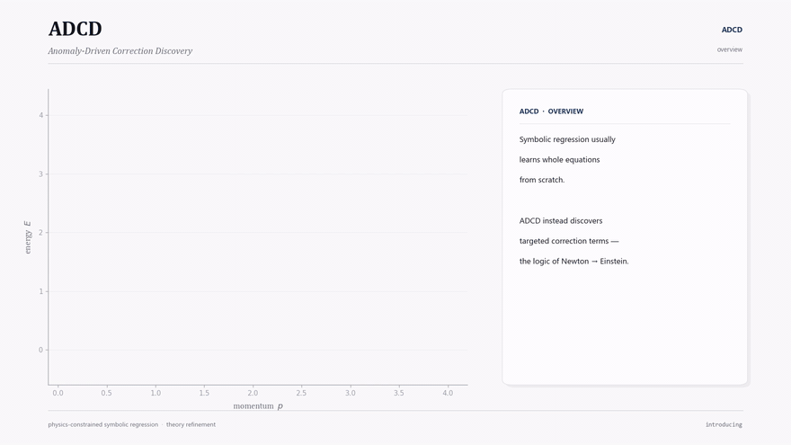

# ADCD — Anomaly-Driven Correction Discovery

<p align="center">
  <em>Physics-constrained symbolic regression for discovering symbolic corrections to known physical laws.</em>
</p>

<p align="center">
  
</p>

<p align="center">
  <a href="assets/adcd_discovery.mp4">▶ Download video (MP4)</a>
</p>

<p align="center">
  <a href="https://doi.org/10.5281/zenodo.20534940"></a>
  <a href="LICENSE"></a>
  <a href="https://pypi.org/project/adcd/"></a>
</p>

---

## 📌 Overview

**ADCD (Anomaly-Driven Correction Discovery)** is a physics-informed symbolic regression framework designed for theory refinement rather than unconstrained tabula rasa discovery. By starting from a known classical baseline law `y_classical`, ADCD targets the dimensionless correction term `Δ` (`y = y_classical * (1 + Δ)` or `y = y_classical + Δ`).

### Core Claims of the Paper:
1. **Primary Benchmark Performance**: Achieves a mean structural recovery rate of **80.4% (± 7.4%)** across 16 independent seeds on a 9-scenario × 4-noise-level synthetic benchmark (outperforming unconstrained PySR by 77.8 percentage points at 5% noise).
2. **SPARC Real Astrophysical Discovery**: Autonomously rediscovers a 2-parameter member of the **Simple MOND** algebraic family on 171 galaxy rotation curves (N = 3,342, stacked NMSE = 0.3729, statistically matching domain-expert forms under galaxy-level cross-validation and cluster bootstrap).
3. **Execution Speed**: Completes full-pipeline search and optimization in **4.2s – 4.9s** per run on consumer-grade dual-core CPUs without requiring GPUs.
4. **Fail-Safe & Cosmological Null**: Demonstrates a **0.0% false positive rate** under baseline misspecifications, and establishes a `constant_wins` amplitude-rescaling null result on cosmological fσ₈(z) and H(z) probes.

---

## 📦 Installation

Install the package from PyPI:

```bash
pip install adcd
```

Or install from source:

```bash
git clone https://github.com/apiprdt/PhysicsPaper.git
cd PhysicsPaper
pip install -e ".[dev]"
```

---

## 💻 Quick Start

### 1. High-Level Scientific API

```python
import adcd

# 1. Load a pre-defined benchmark scenario
scenarios = adcd.get_all_scenarios()
scenario = scenarios[0]

# 2. Run discovery
result = adcd.discover_correction(scenario, max_iterations=5, proposer="mock")

# 3. Inspect results
print(f"Discovered correction: {result.best_expr}")       # \theta_0 (v/c)^2
print(f"LaTeX representation:  {result.export_latex()}")
print(f"BIC Score:             {result.best_bic:.2f}")
```

### 2. Custom Dataset Fitting

```python
import numpy as np
import adcd

# Define observational data and classical prediction
x = np.linspace(1.0, 5.0, 100)
X = {"x": x}
y_classical = 2.0 * x
y_observed  = 2.0 * x + 0.5 * x**2

# Fit correction
result = adcd.fit(
    X=X,
    y_obs=y_observed,
    y_classical=y_classical,
    limit_variable="x",
    limit_direction="0",
    correction_mode="additive",
    verbose=True
)

print(result.summary())
```

---

## 📁 Repository & Project Structure

```
PhysicsPaper/
├── src/adcd/                       # Installable Python package source
│   ├── __init__.py                 # Public API (fit, discover_correction)
│   ├── anomaly_scenarios.py        # Benchmark scenario definitions
│   ├── arc_scorer.py               # Asymptotic consistency gate (ARC)
│   ├── dimensional_checker.py      # Dimensional homogeneity gate
│   ├── jax_optimizer.py            # JAX L-BFGS-B multi-restart optimizer
│   ├── metrics.py                  # NMSE, BIC, and structural classifier
│   └── pipeline.py                 # Stage 1 filter cascade
├── paper/                          # LaTeX paper source & compiled PDFs
│   ├── main.tex                    # Main manuscript LaTeX (25 pages)
│   ├── main.pdf                    # Main manuscript PDF
│   ├── supplementary.tex           # Supplementary appendix LaTeX (4 pages)
│   └── supplementary.pdf           # Supplementary appendix PDF
├── tests/                          # Unit and integration test suite
├── run_correction_discovery.py     # Benchmark runner script
└── README.md                       # Repository overview
```

---

## 🔬 Reproducibility & Testing

Run the test suite:
```bash
python -m pytest tests/
```

Run the primary 9-scenario benchmark:
```bash
python run_correction_discovery.py
```

---

## 📖 Citation

```bibtex
@software{erdita2026adcd,
  author    = {Erdita, Muhammad Afif},
  title     = {{Anomaly-Driven Correction Discovery (ADCD): Physics-Constrained
                Symbolic Regression for Evolutionary Scientific Discovery}},
  year      = {2026},
  publisher = {Zenodo},
  version   = {3.0.0},
  doi       = {10.5281/zenodo.20534940},
  url       = {https://doi.org/10.5281/zenodo.20534940}
}
```

---

## AI Assistance & Declarations

AI coding assistants (Google DeepMind's Antigravity agent, Cursor IDE) were used strictly as pair-programming tools for code implementation, benchmark execution, figure rendering, and manuscript formatting under direct human direction. All research concepts, theoretical formulations, experimental design decisions, physical interpretations, and intellectual contributions are entirely the author's own.

---

## 📄 License

This project is licensed under the [MIT License](LICENSE).
