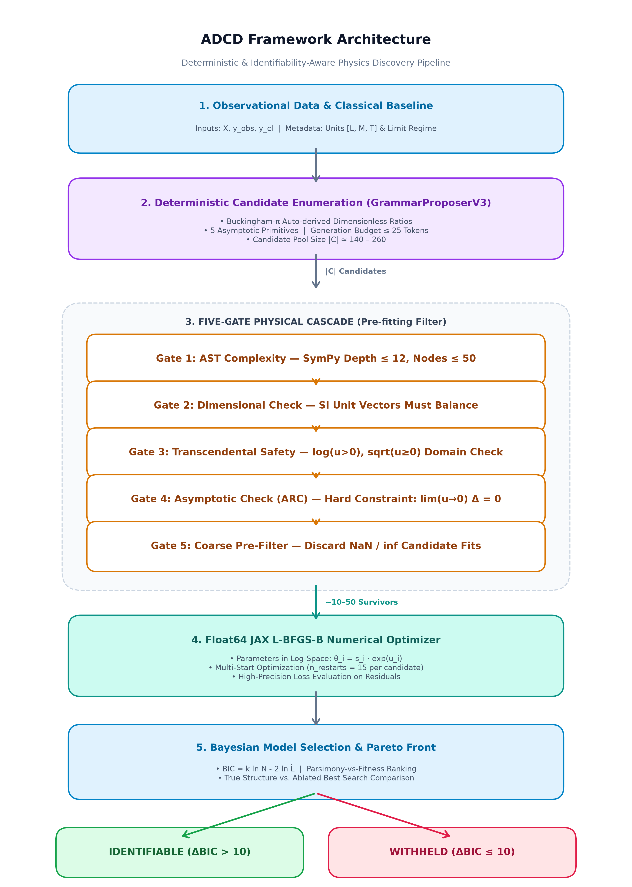

<div align="center">

<h1>⚛️ Asymptotic Dictionary Correction Discovery (ADCD)</h1>
<p><em>A deterministic framework for recovering algebraic corrections to known physical laws from noisy observational data.</em></p>

<p>
  <a href="https://opensource.org/licenses/MIT"></a>
  <a href="https://www.python.org/downloads/release/python-3100/"></a>
  <a href="https://github.com/google/jax"></a>
  <a href="#reproducibility"></a>
</p>

</div>

---

## Table of Contents

1. [Installation](#installation)
2. [Quick Start](#quick-start)
3. [Python API](#python-api)
   - [Define a Scenario](#1-define-a-scenario)
   - [Generate Data](#2-generate-data)
   - [Run the Validation Protocol](#3-run-the-validation-protocol)
   - [Inspect Results](#4-inspect-results)
   - [Individual Components](#5-individual-components)
4. [How ADCD Works](#how-adcd-works)
5. [Validated Results](#validated-results)
6. [Repository Structure](#repository-structure)
7. [Reproducibility](#reproducibility)
8. [Limitations](#limitations)
9. [Citation & License](#citation--license)

---

## Installation

**Requirements:** Python 3.10+, CPU only (no GPU needed)

```bash
# Clone
git clone <repo-url>
cd PhysicsPaper

# Virtual environment
python -m venv .venv
source .venv/bin/activate          # Linux / macOS
# .\.venv\Scripts\Activate.ps1    # Windows PowerShell

# Install (pinned to exact paper versions)
pip install -r requirements.txt

# Set source path (required before any command)
export PYTHONPATH=src              # Linux / macOS
# $env:PYTHONPATH = "src"         # Windows PowerShell
```

---

## Quick Start

Reproduce the paper's full validation suite with one command:

```bash
export PYTHONPATH=src
python src/adcd/run_adcd_v3_validation_blind.py --top-k 5
```

Save output for archiving:

```bash
python src/adcd/run_adcd_v3_validation_blind.py --top-k 5 > blind_validation_output_v3.txt 2>&1
```

A machine-readable report is also saved to `adcd_v3_blind_validation_report.json` automatically.

---

## Python API

### 1. Define a Scenario

```python
from adcd.anomaly_scenarios import AnomalyScenario

scenario = AnomalyScenario(
    name="My Scenario",
    tier="synthetic",            # "textbook" | "synthetic" | "cross_domain"
    domain="mechanics",

    # Known classical law
    classical_expr="0.5 * m * v**2",
    classical_variables=["m", "v"],
    classical_constants={"c": 2.99792458e8},

    # Ground truth correction — withheld from pipeline, used only for evaluation
    correction_type="multiplicative",      # "multiplicative" | "additive"
    correction_expr="theta_0 * (v/c)**2",
    correction_constants={"theta_0": 0.5},

    # Physical metadata
    anomaly_regime="high speeds v approaching c",
    variables_with_units={"m": "kg", "v": "m/s", "c": "m/s"},
    classical_limit_variable="v",
    classical_limit_direction="0",
    correction_class="rational",  # "rational"|"logarithmic"|"exponential"|"power_law"
)
```

### 2. Generate Data

```python
# Returns: (X_dict, y_obs, y_classical, residual)
X, y_obs, y_classical, residual = scenario.generate_data(
    n_points=200,
    noise_level=0.01,   # 1% Gaussian multiplicative noise
    seed=42,
    domain_max=0.3,     # upper bound on the primary ratio range (e.g. v/c ≤ 0.3)
)
```

### 3. Run the Validation Protocol

The main entry point runs the full 4-step blind protocol and prints structured results:

```python
# Run from the command line, or call programmatically:
from adcd.run_adcd_v3_validation_blind import run_scenario_protocol

results = run_scenario_protocol(scenario, top_k=5)
```

Or call the pipeline directly for more control:

```python
from adcd.pipeline import Stage1Pipeline
from adcd.grammar_proposer_v3 import GrammarProposerV3
from adcd.dimensional_checker import DimensionalChecker
from adcd.arc_scorer import ARCScorer, build_arc_regimes
from adcd.context import ProposalContext

checker = DimensionalChecker()
arc     = ARCScorer(regimes=build_arc_regimes())
context = ProposalContext.from_scenario(scenario)

proposer   = GrammarProposerV3()
candidates = proposer.propose(context)          # fully blind, no ratio hints
print(f"Search space: {len(candidates)} candidates")

pipeline   = Stage1Pipeline(checker, scenario)
survivors  = pipeline.run(candidates, X, y_obs, y_classical)
print(f"Survived all 5 gates: {len(survivors)} candidates")
```

### 4. Inspect Results

```python
# results dict from run_scenario_protocol()
print(f"Verdict:            {results['verdict']}")           # IDENTIFIABLE | WITHHELD
print(f"Top candidate:      {results['blind_search']['top_candidate']}")
print(f"NMSE:               {results['blind_search']['nmse']:.4e}")
print(f"BIC:                {results['blind_search']['bic']:.2f}")
print(f"ΔBIC (ablation):    {results['ablation_control']['bic_diff']:.2f}")
print(f"Symbolic match:     {results['blind_search']['symbolic_match']}")
print(f"Class match:        {results['blind_search']['class_match']}")

# Top-k Pareto front
for rank, c in enumerate(results['pareto_front'], 1):
    print(f"  Rank {rank} | BIC {c['bic']:>10.2f} | NMSE {c['nmse']:.3e} | {c['expr']}")
```

**Example output:**
```
Verdict:            IDENTIFIABLE
Top candidate:      theta_2 * (exp(-r/theta_0) - 1.0)
NMSE:               2.7722e-04
BIC:                -1617.66
ΔBIC (ablation):    25.74
Symbolic match:     True
Class match:        True

  Rank 1 | BIC   -1617.66 | NMSE 2.77e-04 | theta_2 * (exp(-r/theta_0) - 1.0)
  Rank 2 | BIC   -1612.93 | NMSE 2.76e-04 | theta_47 * (exp(-r/theta_0) - 1.0) * (...)
```

### 5. Individual Components

#### Dimensional Checker

```python
from adcd.dimensional_checker import DimensionalChecker
import sympy as sp

checker = DimensionalChecker()
checker.registry["v"] = [1, 0, -1]   # m/s  → [L, M, T]
checker.registry["c"] = [1, 0, -1]   # m/s

v, c = sp.symbols("v c")
is_ok, dims = checker.check_dimensionless(v**2 / c**2)
print(is_ok, dims)   # True  [0, 0, 0]
```

#### ARC Scorer (Asymptotic Regime Check)

```python
from adcd.arc_scorer import ARCScorer, build_arc_regimes
import sympy as sp

arc = ARCScorer(regimes=build_arc_regimes())
u   = sp.Symbol("u")

print(arc.passes(u / (1 - u), limit_var=u, limit_val=0))          # True  ✓ vanishes
print(arc.passes(sp.Rational(1, 2) + u, limit_var=u, limit_val=0)) # False ✗ doesn't vanish
```

#### JAX Optimizer (standalone fit)

```python
from adcd.jax_optimizer import JaxOptimizer
import sympy as sp, numpy as np

optimizer = JaxOptimizer(n_restarts=15)
expr      = sp.sympify("theta_0 * (exp(-r / theta_1) - 1)")

params, nmse = optimizer.fit(expr, X={"r": r_data}, y=residual_data)
print(f"Fitted params: {params}")
print(f"NMSE: {nmse:.4e}")
```

#### BIC & Identifiability

```python
from adcd.identifiability import compute_bic, identifiability_verdict

bic = compute_bic(nmse=2.77e-4, n_params=2, n_points=200)

delta_bic = bic_true_structure - bic_ablated_best
verdict   = identifiability_verdict(delta_bic)   # "IDENTIFIABLE" | "WITHHELD"
print(f"ΔBIC = {delta_bic:.2f}  →  {verdict}")
```

---

## How ADCD Works

**Core idea:** assume the classical baseline is known, search only for the algebraic correction $\Delta$ that makes $y_\text{obs} = y_\text{cl} \cdot (1 + \Delta)$, subject to the hard constraint $\lim_{u \to 0} \Delta = 0$.

<p align="center">
  
</p>


### The 5 Primitives

All corrections are expressed over five algebraically regularized basis functions, each vanishing at $u = 0$ by construction:

| Name | $D(u)$ | Domain | Physical archetype |
|:---|:---|:---|:---|
| `D_lor` | $u / [\sqrt{1-u}\,(\sqrt{1-u}+1)]$ | $u \in [0,1)$ | Lorentz / relativity |
| `D_rat` | $u / (1-u)$ | $u \neq 1$ | Rational poles |
| `D_exp` | $e^{-u} - 1$ | all $u$ | Exponential screening |
| `D_log` | $\ln(1+u)$ | $u > -1$ | Entropy, Van der Waals |
| `D_sqrt_inv` | $1/\sqrt{1+u} - 1$ | $u > -1$ | Inverse-root corrections |

### 4-Step Validation Protocol

| Step | Name | Passes when |
|:---|:---|:---|
| **1** | Budget Disclosure | Search space size logged before results |
| **2** | Positive Control | Optimizer recovers structure when restricted to correct primitive family (NMSE < 0.05) |
| **3** | Ablation Control | $\Delta\text{BIC} > 10$ vs. best model without correct primitive |
| **4** | Determinism Check | 3 independent runs produce byte-exact identical output |

---

## Validated Results

Three scenarios, $N = 200$ points, 1% Gaussian noise, `seed = 42`. All numbers from a live JAX run — see `blind_validation_output_v3.txt`.

| Scenario | Observation window | Rank 1 structure | ΔBIC | NMSE (blind) | Verdict |
|:---|:---|:---|---:|---:|:---|
| Time Dilation | $v \le 0.3c$ | $\theta_0 \cdot D_\text{lor}(v^2/c^2)$ | −0.74 | 0.412 | WITHHELD |
| Screened Coulomb | $r \le 4.0$ | $\theta_2(e^{-r/\theta_0} - 1)$ | 25.74 | 2.77 × 10⁻⁴ | IDENTIFIABLE* |
| Entropy Expansion | $dV/V_i \le 1.0$ | $\theta_3 \ln(1 + dV/V_i)$ | 37.99 | 0.0159 | IDENTIFIABLE |

> *Screened Coulomb is statistically identifiable (ΔBIC > 10) but fails the positive-control step due to optimizer sensitivity at small pool sizes. See [Limitations](#limitations).

---

## Repository Structure

```
src/adcd/
├── run_adcd_v3_validation_blind.py   ← main entry point (4-step protocol)
├── anomaly_scenarios.py              ← AnomalyScenario dataclass + data generation
├── grammar_proposer_v3.py            ← deterministic candidate enumeration
├── asymptotic_dictionary_proposer_v3.py  ← Buckingham-Pi ratio derivation
├── pipeline.py                       ← orchestrates all 5 physical gates
├── arc_scorer.py                     ← Gate 4: asymptotic limit check
├── dimensional_checker.py            ← Gates 1–3: AST, units, transcendental safety
├── coarse_evaluator.py               ← Gate 5: NaN/inf pre-filter
├── jax_optimizer.py                  ← Float64 JAX L-BFGS-B, log-space params
├── bayesian_ranker.py                ← BIC ranking and Pareto front
├── identifiability.py                ← ΔBIC computation and verdict logic
├── metrics.py                        ← NMSE, symbolic matching, classification
├── constants.py                      ← CODATA 2018 physical constants
├── quickfit.py                       ← convenience wrapper for single fits
├── real_data_loader.py               ← loader for external observational data
└── real_scenarios.py                 ← non-synthetic scenario definitions
```

---

## Reproducibility

```bash
export PYTHONPATH=src
python src/adcd/run_adcd_v3_validation_blind.py --top-k 5 > blind_validation_output_v3.txt 2>&1
```

Results are byte-exact across runs because:
- Search is fully deterministic (grammar enumeration, fixed seed)
- No stochastic elements (no genetic mutation, no random tree crossover)
- JAX computation graph is `jit`-compiled on CPU

For the full provenance chain — including discarded historical number sets and the a-priori AST budget justification — see [REPRODUCIBILITY.md](REPRODUCIBILITY.md).

---

## Limitations

| Issue | Detail |
|:---|:---|
| **Positive-control sensitivity** | Screened Coulomb fails Step 2 (NMSE = 0.083 > 0.05) when pool is restricted to 4 candidates. Full blind search succeeds. Cause: optimizer sensitivity to initialization at small pool sizes. |
| **Charge / temperature are dimensionless** | The dimensional checker treats charge and temperature as `[0,0,0]` by convention. Ratios involving these quantities require manual registry augmentation. |
| **Multiplicative corrections only** | Grammar targets $y = y_\text{cl}(1 + \Delta)$. Additive corrections need a different residual normalization. |
| **Synthetic data only** | Validated on Gaussian noise with known structure. Extension to real observational data is future work. |
| **Window-dependent verdicts** | Identifiability depends on the observation regime. Results are specific to the stated domain bounds. |

---

## Citation & License

```bibtex
@inproceedings{adcd2026,
  title     = {Asymptotic Dictionary Correction Discovery: A Deterministic,
               Identifiability-Aware Framework for Recovering Physical Corrections
               from Observational Data},
  author    = {Anonymous Author(s)},
  booktitle = {New in ML Workshop @ NeurIPS 2026},
  year      = {2026},
}
```

Released under the **MIT License** — see [LICENSE](LICENSE).
