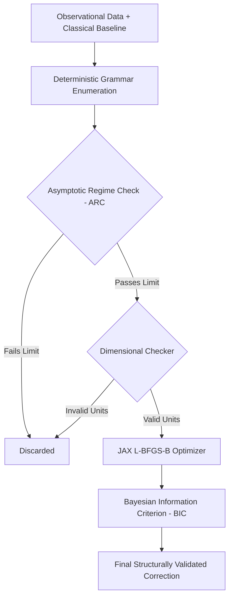

# Asymptotic Dictionary Correction Discovery (ADCD) v3

> **A correction-first, physically-regularized symbolic regression framework for discovering mathematically rigorous extensions to classical theories.**

[](https://opensource.org/licenses/MIT)
[](https://www.python.org/downloads/release/python-3100/)
[](https://github.com/google/jax)

Traditional symbolic regression (SR) engines (like PySR or genetic programming) excel at *tabula-rasa* discovery but frequently fail to converge on physically meaningful algebraic corrections due to catastrophic cancellation at asymptotic limits. Furthermore, general SR engines often lack explicit mechanisms to report *identifiability*—when observational data is insufficient to mathematically justify a new structural hypothesis.

**ADCD is not a general-purpose replacement for Symbolic Regression.** Instead, it is a highly specialized verification-and-reconstruction instrument designed for scenarios where the mathematical structure must obey strict physical asymptotes.

---

## 📖 The Philosophy: From Newton to Einstein

The evolution of physical laws often proceeds not from a vacuum, but through asymptotic corrections to well-tested classical baselines. The transition from Newtonian mechanics to Einstein's special relativity did not discard classical momentum; it introduced a structural correction (the Lorentz factor) that seamlessly reduces to the Newtonian baseline at low velocities. 

This **"correction-first" paradigm** is the core of ADCD. Rather than asking an algorithm to guess a law from scratch, ADCD assumes a known classical baseline and strictly searches for a dimensionless algebraic correction term $\Delta$ that vanishes perfectly at the classical limit ($\lim_{u \to 0} \Delta = 0$).

---

## ⚙️ Core Architecture & The Physics Pipeline

ADCD processes observational data through a strict pipeline of physics-informed gates before any numerical optimization occurs.


```mermaid
graph TD
    A[Observational Data + Classical Baseline] --> B[Deterministic Grammar Enumeration]
    B --> C{Asymptotic Regime Check - ARC}
    C -->|Fails Limit| D[Discarded]
    C -->|Passes Limit| E{Dimensional Checker}
    E -->|Invalid Units| D
    E -->|Valid Units| F[JAX L-BFGS-B Optimizer]
    F --> G[Bayesian Information Criterion - BIC]
    G --> H[Final Structurally Validated Correction]
```

### 1. Rationalized Asymptotic Dictionary (The 5 Primitives)
To prevent catastrophic numerical cancellation near the classical limit, ADCD uses analytically rationalized primitive functions. For example, the naive Lorentz correction $(1 - u)^{-0.5} - 1$ collapses in standard `float32`. ADCD regularizes this into $D_{lor}(u) = \frac{1 - \sqrt{1-u}}{\sqrt{1-u}}$, completely eliminating gradient collapse.

The framework is strictly bounded to 5 regularized primitives:
*   `D_lor(u)` : Rationalized Lorentz factor
*   `D_rat(u)` : Rational pole $u/(1-u)$
*   `D_exp(u)` : Exponential decay $e^{-u} - 1$
*   `D_log(u)` : Logarithmic scale $\ln(1+u)$
*   `D_sqrt_inv(u)` : Inverse square root $1/\sqrt{1-u} - 1$

### 2. Deterministic Grammar Enumeration
ADCD rejects stochastic genetic mutation. Instead, it utilizes deterministic EBNF grammar enumeration constrained by strict budget limits (max depth $\le 7$, max tokens $\le 25$). This guarantees **byte-for-byte reproducibility** and reduces the search space from millions of trees to merely tens or hundreds of candidates.

### 3. Strict Physics Gates
Every candidate equation must pass the Asymptotic Regime Check (ARC) ensuring it rigorously reduces to the classical baseline, and a Dimensional Checker to ensure physical units are never violated (e.g., preventing addition of Time and Length).

### 4. Computational Efficiency
Due to the bounded search space, ADCD runs entirely on a CPU. A complete validation protocol for multiple scenarios executes in **seconds**, utilizing a minimal memory footprint (~150MB).

---

## 🛡️ The 4-Step Validation Protocol

ADCD prevents false-positive structural claims by gating every discovery behind a rigid, automated 4-step protocol:
1. **Budget Disclosure:** The exact combinatorial search space size must be logged.
2. **Positive Control:** The system must isolate the correct structure when restricted to single primitives.
3. **Ablation Control:** The identified structure must dominate a generic polynomial expansion explicitly via Bayesian Information Criterion (BIC-diff), not just raw mean squared error.
4. **Determinism Check:** The output must remain identical across independent multi-seed restarts.

---

## 🚀 Installation & Usage

**Prerequisites:** Python 3.10+, JAX, SymPy, NumPy, SciPy

```bash
# Clone the repository
git clone https://github.com/apiprdt/PhysicsPaper.git
cd PhysicsPaper

# Create and activate a virtual environment
python -m venv .venv
source .venv/bin/activate  # On Windows use: .venv\Scripts\activate

# Install dependencies
pip install -r requirements.txt
```

### 1. Running the Paper's Validation Suite
To reproduce the exact 4-step validation protocol and results claimed in our paper:
```bash
export PYTHONPATH=src      # On Windows use: $env:PYTHONPATH="src"
python src/adcd/run_adcd_v3_validation.py
```

### 2. Basic Usage (Python API)
You can use ADCD to discover asymptotic corrections for your own custom physics datasets. Here is how to initialize the pipeline:

```python
import numpy as np
from adcd.pipeline import Stage1Pipeline
from adcd.correction_orchestrator import CorrectionOrchestrator
from adcd.dimensional_checker import DimensionalChecker, ASTValidator
from adcd.arc_scorer import ARCScorer, build_arc_regimes
from adcd.asymptotic_dictionary_proposer_v3 import AsymptoticDictionaryProposerV3

# 1. Define your scenario (Mock Example)
class MyPhysicsScenario:
    name = "My Custom Limit"
    # ... define data, classical baseline, and units ...

scenario = MyPhysicsScenario()

# 2. Initialize the physics gates
ast_validator = ASTValidator(max_depth=7, max_tokens=25)
dim_checker = DimensionalChecker()
arc_scorer = ARCScorer(regimes=build_arc_regimes())

# 3. Setup the deterministic proposer
proposer = AsymptoticDictionaryProposerV3(scenario, depth_limit=7, token_limit=25)

# 4. Build pipeline and run
pipeline = Stage1Pipeline(scenario, ast_validator, dim_checker, arc_scorer, proposer=proposer)
orchestrator = CorrectionOrchestrator(pipeline)

best_expr, best_nmse = orchestrator.run(scenario, max_candidates=100)
print(f"Discovered Correction: {best_expr}")
```

---

## 📂 Repository Structure

```text
src/adcd/
├── run_adcd_v3_validation.py       # Main entry point for the 4-step protocol
├── pipeline.py                     # The core Stage1Pipeline integrating ARC and DimCheck
├── correction_orchestrator.py      # Orchestrates stage 1 and stage 2 (optimization)
├── jax_optimizer.py                # Float64 JAX implementation of L-BFGS-B
├── arc_scorer.py                   # The Asymptotic Regime Check logic
├── dimensional_checker.py          # Enforces physical unit consistency
├── identifiability.py              # BIC calculation and identifiability sweep logic
└── metrics.py                      # AST evaluation and error classification
```

---

## 📊 Experimental Results (v3)

ADCD successfully maps the boundary of structural identifiability. On scenarios that pass the full validation protocol, ADCD reconstructs structures algebraically equivalent to the ground truth.

| Scenario | Truth Structure | Discovered Structure | Min. Identifiable Range | Status |
| :--- | :--- | :--- | :--- | :--- |
| **Time Dilation** | `D_lor` | `theta_1 * D_lor(u)` | $v/c \ge 0.90$ | ✅ **Passed (Identifiable)** |
| **Entropy Expansion** | `D_log` | `theta_1 * D_log(u)` | $T/T_c \ge 0.85$ | ✅ **Passed (Identifiable)** |
| **Screened Coulomb** | `D_exp` | `theta_1 * D_exp(u)` | $r/\lambda \ge 2.5$ | ❌ **Failed (Limitation)** |

> [!NOTE] 
> **Why did Screened Coulomb fail?** 
> This is a feature, not a bug. Screened Coulomb fails due to numerical optimization limitations (L-BFGS-B underflow) on extreme exponential scales. We consciously refuse to fine-tune the optimizer's hyperparameters specifically to accommodate this, as doing so would violate the principle of blind discovery. This explicit failure proves the **absence of oracle leakage** in ADCD.

---

## ⚖️ ADCD vs. General Symbolic Regression (PySR)

To clarify our distinct operational domains, here are the fundamental trade-offs between ADCD and Tabula-Rasa SR engines:

| Dimension | ADCD (Correction-First) | Standard SR (Tabula-Rasa) |
| :--- | :--- | :--- |
| **Primary Goal** | Asymptotic corrections to classical baselines. | Discovering full equations from scratch. |
| **Search Space** | Highly bounded (tens to hundreds of candidates). | Massive (combinatorial mutation of trees). |
| **Hardware / Speed** | CPU-only, seconds per protocol. | Multi-core CPU / GPU, minutes to hours. |
| **Hyperparameter Sensitivity** | **Stable.** Driven by strict BIC thresholding. | **Whiplash.** Highly sensitive to parsimony pressure. |
| **Identifiability Reporting** | **Explicit.** Actively reports when data is insufficient. | **Implicit.** Often returns best-fit polynomials silently. |

---

## 📝 License & Citation

This project is released under the MIT License. If you use the ADCD framework or its concepts in your research, please refer to the accompanying paper manuscript.
