# Noise Robustness

Experimental data is always noisy. We evaluated ADCD's robustness by adding Gaussian noise to the observed values at levels ranging from 0% to 10% of the target's standard deviation:

$$
y_{\text{observed}} = y_{\text{true}} + \epsilon, \quad \epsilon \sim \mathcal{N}\left(0, \sigma_{\text{noise}}^2\right)
$$

## Multi-Seed Robustness Summary (5 seeds)

Below is the mean structural recovery rate across all 9 scenarios and 5 random seeds (0, 7, 21, 42, 99) as a function of noise level:

- **0% Noise**: **93.3%**
- **1% Noise**: **91.1%**
- **5% Noise**: **71.1%**
- **10% Noise**: **68.9%**

```mermaid
gantt
    title Recovery Rate vs Noise Level
    dateFormat  X
    axisFormat %s
    section Recovery Rate
    0% Noise (93.3%)  :active, 0, 93
    1% Noise (91.1%)  :active, 0, 91
    5% Noise (71.1%)  :active, 0, 71
    10% Noise (68.9%) :active, 0, 69
```

## Why ADCD is Noise-Robust

1. **JAX Multi-restart**: Multi-restart L-BFGS-B optimization prevents the parameter fitting from getting stuck in noise-induced local minima.
2. **BIC Penalty**: The Bayesian Information Criterion penalizes complex equations, meaning a noisy fluctuation is rarely enough to justify selecting a more complex, incorrect formula over the simpler, correct one.
3. **Statistical Prior Guidance**: The residual analyzer extracts global trends (e.g., whether the function is monotonic or convex) which are less affected by high-frequency Gaussian noise.
