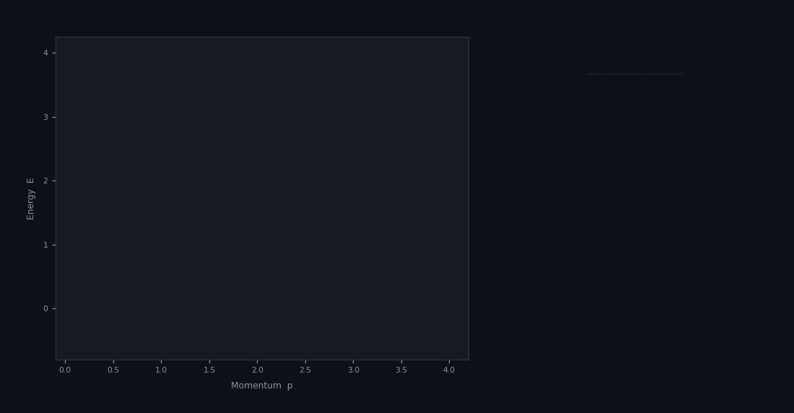

---
hide:
  - navigation
  - toc
---

<div class="adcd-hero" markdown>

# ADCD
## Anomaly-Driven Correction Discovery

<p class="tagline">
Physics-constrained symbolic regression that discovers <em>correction terms</em>  
rather than learning equations from scratch — the same logic that led from  
Newton to Einstein, from Rayleigh–Jeans to Planck.
</p>

<div class="cta-buttons" markdown>
<a href="getting-started/" class="cta-btn primary">⚡ Get Started</a>
<a href="getting-started/quickstart/" class="cta-btn secondary">📖 Quickstart</a>
<a href="https://colab.research.google.com/github/apiprdt/PhysicsPaper/blob/main/notebooks/adcd_demo.ipynb" class="cta-btn secondary">▶ Run in Colab</a>
</div>

[](https://github.com/apiprdt/PhysicsPaper/actions)
[](https://pypi.org/project/adcd/)
[](https://doi.org/10.5281/zenodo.20534940)
[](https://opensource.org/licenses/MIT)
[](https://github.com/apiprdt/PhysicsPaper/actions)

</div>

---

## See It in Action



---

## Key Numbers

<div class="stats-grid" markdown>
<div class="stat-card">
<span class="number">82.8%</span>
<span class="label">Mean structural recovery (5 seeds)</span>
</div>
<div class="stat-card">
<span class="number">94.4%</span>
<span class="label">Peak accuracy (seed=42)</span>
</div>
<div class="stat-card">
<span class="number">4/4</span>
<span class="label">Real-world class matches</span>
</div>
<div class="stat-card">
<span class="number">+77.8 pp</span>
<span class="label">Over PySR at 5% noise</span>
</div>
<div class="stat-card">
<span class="number">116</span>
<span class="label">Automated tests passing</span>
</div>
<div class="stat-card">
<span class="number">v2.2.1</span>
<span class="label">Latest stable release</span>
</div>
</div>

---

## Why ADCD?

Most symbolic regression tools (PySR, DSR, GPLearn) try to discover equations **from a blank slate**. ADCD takes a fundamentally different approach:

!!! quote "The Correction-First Paradigm"
    Science rarely discovers from scratch — it **corrects**.  
    Every major breakthrough started with an anomaly in a known law,  
    not an empty search space.

ADCD encodes this insight as software:

\[
y_{\text{obs}} = y_{\text{classical}} + \Delta(\mathbf{x};\,\boldsymbol{\theta})
\]

Where \(\Delta\) is the **dimensionless correction term** ADCD searches for, constrained by physics gates before any numerical optimization runs.

---

## Feature Highlights

<div class="feature-grid" markdown>
<div class="feature-card">
<span class="icon">🎯</span>
<h3>Correction-First Paradigm</h3>
<p>Starts from a known classical law, not a blank slate. Dramatically reduces search space by targeting only the residual anomaly Δ.</p>
</div>

<div class="feature-card">
<span class="icon">⚛️</span>
<h3>Cascaded Physics Gates</h3>
<p>AST complexity, dimensional homogeneity, transcendental guardrails, and asymptotic consistency (ARC) screens unphysical candidates <em>before</em> optimization.</p>
</div>

<div class="feature-card">
<span class="icon">🚀</span>
<h3>JAX-Traced L-BFGS-B</h3>
<p>Parameter-scaled differentiable fitting with multi-restart log-uniform initialization. Fast, robust, GPU-ready via JAX autodiff.</p>
</div>

<div class="feature-card">
<span class="icon">📊</span>
<h3>BIC Reranking</h3>
<p>Selects the most parsimonious correction over purely numerical fits, penalizing complexity and preventing overfitting.</p>
</div>

<div class="feature-card">
<span class="icon">🧠</span>
<h3>Residual Feature Intelligence</h3>
<p>Statistical priors (monotonicity, curvature, oscillation, symmetry) bias the template sampler toward the correct mathematical family.</p>
</div>

<div class="feature-card">
<span class="icon">🔬</span>
<h3>Real-World Validated</h3>
<p>4/4 correct structural class matches on Mercury perihelion (GR), Lamb Shift (QED), Muon g-2 (Schwinger), and Blackbody (Planck).</p>
</div>
</div>

---

## 30-Second Install

```bash
pip install adcd
```

```python
import adcd

scenario = adcd.get_all_scenarios()[0]          # Relativistic Kinetic Energy
result   = adcd.discover_correction(scenario)    # One line!

print(result.best_expr)       # θ₀·(v/c)²
print(result.export_latex())  # \theta_0 \left(\frac{v}{c}\right)^2
result.plot_residuals()       # Matplotlib plot
```

---

## Benchmark vs PySR

| Method | 0% Noise | 1% Noise | 5% Noise | 10% Noise |
|--------|:---:|:---:|:---:|:---:|
| **ADCD** (ours, seed=42) | **9/9 (100%)** | **9/9 (100%)** | **8/9 (88.9%)** | **8/9 (88.9%)** |
| PySR fair (100 iter, 60s) | 4/9 (44.4%) | 5/9 (55.6%) | 1/9 (11.1%) | 5/9 (55.6%) |

ADCD leads by **+77.8 pp** at 5% noise. See [full benchmark results →](benchmarks/index.md)

---

## Cite This Work

```bibtex
@software{erdita2026adcd,
  author    = {Erdita, Muhammad Afif},
  title     = {{Anomaly-Driven Correction Discovery (ADCD)}},
  year      = {2026},
  publisher = {Zenodo},
  version   = {2.2.1},
  doi       = {10.5281/zenodo.20534940},
  url       = {https://doi.org/10.5281/zenodo.20534940}
}
```
