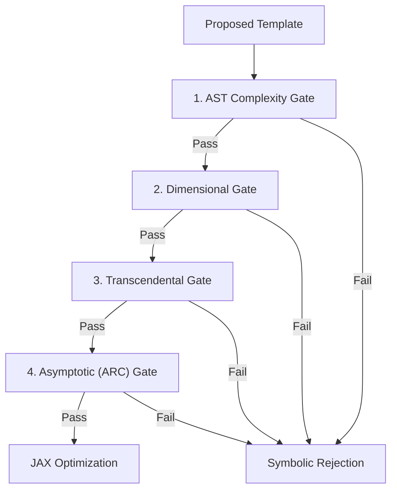

# Physics Gates

To prevent symbolic regression from generating unphysical mathematical constructs, ADCD filters proposed expressions through a pipeline of **four cascading physics gates**. 

Before running any parameter-fitting optimization on a CPU/GPU, the candidate must pass all four checks.

---

## 1. Abstract Syntax Tree (AST) Complexity Gate
Restricts the search budget to parsimonious formulas. 
- Parses the SymPy expression into an AST.
- Counts the number of leaves (variables, constants) and nodes (operators, functions).
- **Condition**: Rejects templates exceeding `max_complexity` (default: 20 tokens).

---

## 2. Dimensional Homogeneity Gate
Enforces the fundamental law of physics: you cannot add quantities of different dimensions (e.g., adding mass to length).
- Analyzes the base dimensions of the inputs ($[M], [L], [T], \dots$).
- Infers the dimension of the correction term $\Delta$.
- **Condition**: Rejects the expression if $\Delta$ does not match the dimension required by the correction mode (e.g., $\Delta$ must be dimensionless for multiplicative corrections, and match $[y_{\text{classical}}]$ for additive corrections).

---

## 3. Transcendental Guardrail Gate
Transcendental functions (like $\sin, \cos, \log, \exp$) can only take **dimensionless arguments**. 
- Traverses the SymPy expression tree to locate transcendental functions.
- Inspects the dimensions of the expression inside the function's argument.
- **Condition**: Rejects the template if any transcendental argument has non-zero physical dimensions. For example, $\exp(v)$ is rejected, but $\exp(v/c)$ is accepted.

---

## 4. Asymptotic Boundary (ARC) Gate
Ensures the correction term obeys the correct physical limits.
- Evaluates the symbolic limit of the template as the limit variable approaches its boundary:
  
  $$\lim_{x \to x_0} \Delta(x) = \Delta_0$$

- **Condition**: Checks if the limit matches the expected behavior of the scenario. For instance, if the classical law is exact at low velocities, the correction $\Delta$ must vanish as $v \to 0$. If the limit evaluates to infinity, NaN, or a non-zero value where zero is expected, it is rejected.
